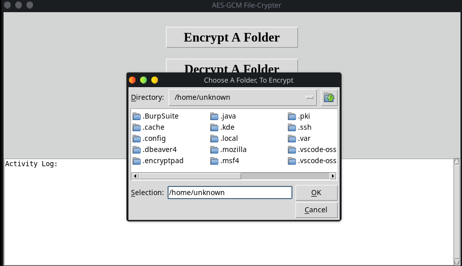
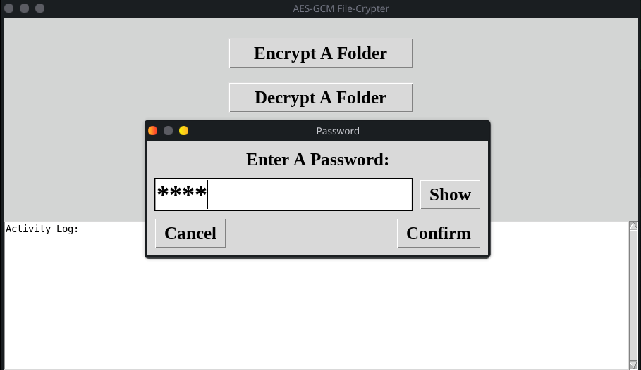

  
<br></br>

# AES-GCM File-Crypter (Graphical User Interface)  

## What Does This Application Do?
This application, makes AES-GCM cryptography of files and/or entire folders, quick and easy for Windows and Linux.

## Forensic Recovery Prevention:
1.) When encrypting/decrypting, data normally stored, in the computer's RAM, until the program is closed, is immediately removed, after the process is finished. \
This feature, is designed to prevent recovery of data, from the RAM, of the device using this program.

2.) After the encryption/decryption step, a temporary file is made, where the encrypted/decrypted data, is copied to, this file is re-named, to the original file's name, after the original file's deletion. The next step, involves the original file, being over-written with random bytes, then it is deleted, followed by the re-naming of the temporary file, to the original file's name. \
This feature, is designed to prevent recovery of the original file's content, from the disk of the device using this program.

## What Is AES-GCM?
AES-GCM, is the most secure and modern approach for encryption/decryption and has 3 options (128, 192, and 256 bit).  
<br></br>

## Windows Version (In the "dist/windows" folder):  
</br>

### 1.) Pick encryption/decryption options  


  

### 2.) Enter the password  

  

### 3.) Encrypt/decrypt a file or an entire folder  
<br></br>

## Linux Version (In the "dist/linux" folder):  
</br>

### 1.) Pick encryption/decryption options  



  

### 2.) Enter the password  

  

### 3.) Encrypt/decrypt a file or an entire folder  
<br></br>

## Compile, Yourself (Optional):  

### Windows:
1.) Make sure the latest python, PyInstaller, and any missing requirements are installed, \
then open a terminal and change directory to this file's directory, before entering the following shellcode \
2.) ```python -m PyInstaller --clean --noconfirm --onefile --windowed --icon=assets/icon/ico/icon.ico --add-data "assets;assets" "AES-GCM File-Crypter.pyw"```  

### Linux:
1.) Make sure the latest python, PyInstaller, and any missing requirements are installed, \
then open a terminal and change directory to this file's directory, before entering the following shellcode \
2.) ```python -m PyInstaller --clean --noconfirm --onefile --windowed --icon="assets/icon/ico/icon.ico" --add-data "assets:assets" --hidden-import=_cffi_backend --collect-binaries cffi --collect-data cffi "AES-GCM File-Crypter.pyw"```
